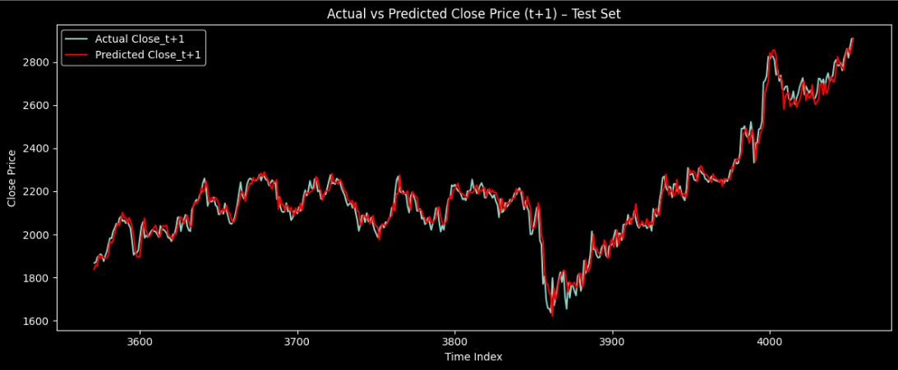

# TCS Stock Price Prediction 

This project predicts the **next day closing price** (`Close_t+1`) of **Tata Consultancy Services (TCS)** stock using a **hybrid deep learning model** that combines:

- Past `n_days` of closing prices (LSTM input)
- Current day's OHLCV (Dense input)
- MultiOutput model for predicting next 5 days of closing price (base model random forest) 

---

## 📊 Dataset

- Source: [Nifty50 Stock Market Data – Kaggle](https://www.kaggle.com/datasets/rohanrao/nifty50-stock-market-data)
- Company: **TCS (Tata Consultancy Services)**
- Range: **2008 to 2020**
- Features: `Date, Open, High, Low, Close, Volume`

---

## 🧠 Problem Statement

> Predict **Close_t+1** (next day closing price) using:
- Past **n_days** of close prices (time series input)
- Today's **OHLCV** (current day market snapshot)
- MultiOutput model for predicting next 5 days of closing price (base model random forest) 

---

## ⚙️ Model Architecture

A **dual-branch neural network** combining both LSTM and Dense layers:

```python
# LSTM on n_days of Close Prices
input_seq = Input(shape=(n_days, 1))
lstm_out = LSTM(64)(input_seq)

# Dense on Today's OHLCV
input_static = Input(shape=(5,))
dense_out = Dense(32, activation='relu')(input_static)

# Merge and Predict
merged = Concatenate()([lstm_out, dense_out])
dense1 = Dense(64, activation='relu')(merged)
output = Dense(1)(dense1)

model = Model(inputs=[input_seq, input_static], outputs=output)
model.compile(optimizer='adam', loss='mse')
````

---

## ✅ Why This Architecture?

| Branch        | Purpose                                 |
| ------------- | --------------------------------------- |
| LSTM       | Learns recent trends in close prices    |
| Dense      | Captures nonlinear patterns from OHLCV  |
| Merged     | Blends past trends and present snapshot |
| Dense Head | Predicts the next day's close price     |

---

## 🧪 Model Training

* Loss: `Mean Squared Error (MSE)`
* Metrics: `MAE`, `RMSE`, and custom `R² Score`
* Validation Strategy: 70% Train, 15% Validation, 15% Test
* Early stopping to prevent overfitting

---

## 📈 Results

* Model performs best when:

  * `n_days` is properly tuned
  * LSTM layers capture historical trend
  * Dense layers learn from OHLCV features
* Validation `R² Score` ≈ 0.9750 (on tuned setup)

---

## 🌲 Random Forest – Multi-Step Forecasting

This traditional ML model predicts the next **5 days of closing prices** (`close_t+1` to `close_t+5`) using today’s `Open`, `High`, `Low`, `Close`, and `Volume` as features.

---

### ⚙️ Model Architecture

A multi-output setup using separate Random Forest regressors per future day:

````python
# Multi-Output Regression with Random Forest
from sklearn.ensemble import RandomForestRegressor
from sklearn.multioutput import MultiOutputRegressor

model = MultiOutputRegressor(
    RandomForestRegressor(n_estimators=100, random_state=42)
)
````

✅ Trains a **separate model for each target** (`close_t+1`, ..., `close_t+5`)

---

### 🔍 Hyperparameter Tuning (Bayesian Search)

Best parameters found via Bayesian Optimization:

````python
{
  'estimator__n_estimators': 300,
  'estimator__max_depth': 28,
  'estimator__max_features': 0.5,
  'estimator__min_samples_split': 2,
  'estimator__min_samples_leaf': 1
}
````

---

### 📈 Results Summary

| Metric     | Before Tuning | After Bayesian Tuning |
| ---------- | ------------- | --------------------- |
| **Day +1** | MSE: 2709.78  | **MSE: 1810.14**      |
|            | R²: 0.9566    | **R²: 0.9710**        |

> ✅ Significant improvement in Day+1 accuracy after tuning.

---

### 🖼️ Visualization


*Actual vs Predicted Closing Price (t+1) using tuned Random Forest model*

---

### 📌 Note

* Model performs best on **short-term forecasting (Day+1)**
* Longer-term (Day+3 to Day+5) accuracy decreases slightly — expected due to uncertainty

---


## 📂 Project Structure

````
├── data/
│   └── TCS.csv                         # Cleaned stock data
├── images/
|   ├── actual_vs_predicted.jpg
├── notebooks/
│   ├── TCS Stock Price Prediction using MultiOutputRegressor.ipynb
│   └── Working with stacked LSTM.ipynb
├── README.md
├── requirements.txt
````

## 🚀 How to Run

1. Clone the repository
    ````
    git clone https://github.com/manishKrMahto/TCS-Stock-Price-Prediction.git
    cd TCS-Stock-Price-Prediction
    ````
2. Install dependencies
    ````
   pip install -r requirements.txt
    ````
3. Run notebook
   Open **Working with stacked LSTM.ipynb** or **CS Stock Price Prediction using MultiOutputRegressor.ipynb** in Jupyter/Colab

---

## 📌 Future Work

* Bayesian Optimization for hyperparameter tuning
* Attention layer integration
* Model deployment 

---

## 👤 Author

**Manish Kumar Mahto**
📧 [manishcode123@gmail.com](mailto:manishcode123@gmail.com)
🔗 [LinkedIn](https://www.linkedin.com/in/manish-kumar-mahto) | [GitHub](https://github.com/manishKrMahto) | [Portfolio Website](https://manishkrmahto.github.io/Manish-Kumar-Mahto/)

---

⭐ Star this repo if you found it helpful!